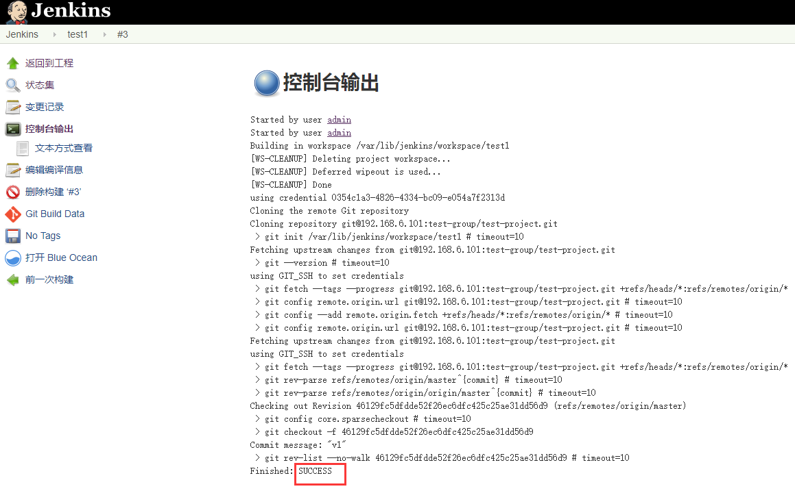

# <h1 id="top">GitLab + Jenkins实现简单代码部署：</h1>
### <a href="#1">规划</a>
### <a href="#2">部署tomcat服务器</a>
### <a href="#3">部署负载均衡</a>
### <a href="#4">部署gitlab</a>
### <a href="#5">部署Jenkins</a>

## <h2 id="1">规划：</h2>
|角色|主机名|IP|
|--|--|--|
|gitlab服务器|gitlab|192.168.6.101|
|Jenkins服务器|jenkins|192.168.6.111|
|LB|LB1|192.168.6.131|
|LB|LB2|192.168.6.132|
|tomcat服务器|tomcat1|192.168.6.141|
|tomcat服务器|tomcat2|192.168.6.142|
## <h2 id="2">部署tomcat服务器：</h2>
1. 安装JDK（oracle官网下载）：
+ 解压：
```
tar xvf jdk-8u192-linux-x64.tar.gz
```
+ 创建软链接：
```
ln -sv /usr/local/src/jdk1.8.0_192/ /usr/local/jdk

ln -sv /usr/local/jdk/bin/java /usr/bin/
```
+ 添加环境变量并使其生效：
```
vim /etc/profile

export HISTTIMEFORMAT="%F %T `whoami`"
export LANG="en_US.utf-8"
export JAVA_HOME=/usr/local/jdk
export PATH=$JAVA_HOME/bin:$JAVA_HOME/jre/bin:$PATH
export CLASSPATH=.$CLASSPATH:$JAVA_HOME/lib:$JAVA_HOME/jre/lib:$JAVA_HOME/lib/tools.jar
```
```
. /etc/profile
```
2. 添加www用户：
```
useradd www -u 2000
```
3. 安装tomcat：
+ 解压：
```
tar xvf apache-tomcat-8.5.42.tar.gz
```
+ 创建软链接：
```
ln -sv /usr/local/src/apache-tomcat-8.5.42 /usr/local/src/tomcat
```
+ 修改目录属主：
```
chown -R www.www /usr/local/src/tomcat/
```
+ 准备tomcat启动脚本：
```shell
vim /etc/init.d/tomcatd

#!/bin/bash  
#  
# chkconfig: - 95 15   
# description: Tomcat start/stop/status script  

#Location of JAVA_HOME (bin files)  
export JAVA_HOME=/usr/local/jdk

#Add Java binary files to PATH  
export PATH=$JAVA_HOME/bin:$PATH

#CATALINA_HOME is the location of the configuration files of this instance of Tomcat  
CATALINA_HOME=/usr/local/src/tomcat

#TOMCAT_USER is the default user of tomcat  
TOMCAT_USER=www

#TOMCAT_USAGE is the message if this script is called without any options  

#SHUTDOWN_WAIT is wait time in seconds for java proccess to stop  
SHUTDOWN_WAIT=20

tomcat_pid() {
        echo `ps -ef | grep $CATALINA_HOME | grep -v grep | tr -s " "|cut -d" " -f2`
}

start() {
  pid=$(tomcat_pid)
  if [ -n "$pid" ];then
    echo -e "\e[00;31mTomcat is already running (pid: $pid)\e[00m"  
  else
    echo -e "\e[00;32mStarting tomcat\e[00m"  
    if [ `user_exists $TOMCAT_USER` = "1" ];then
      su $TOMCAT_USER -c $CATALINA_HOME/bin/startup.sh
    else
      $CATALINA_HOME/bin/startup.sh
    fi
    status
  fi
  return 0
}

status(){
  pid=$(tomcat_pid)
  if [ -n "$pid" ];then
    echo -e "\e[00;32mTomcat is running with pid: $pid\e[00m"  
  else
    echo -e "\e[00;31mTomcat is not running\e[00m"  
  fi
}

stop() {
  pid=$(tomcat_pid)
  if [ -n "$pid" ];then
    echo -e "\e[00;31mStoping Tomcat\e[00m"  
        $CATALINA_HOME/bin/shutdown.sh

    let kwait=$SHUTDOWN_WAIT
    count=0;
    until [ `ps -p $pid | grep -c $pid` = '0' ] || [ $count -gt $kwait ]  
    do
      echo -n -e "\e[00;31mwaiting for processes to exit\e[00m\n";
      sleep 1
      let count=$count+1;
    done

    if [ $count -gt $kwait ];then
      echo -n -e "\n\e[00;31mkilling processes which didn't stop after $SHUTDOWN_WAIT seconds\e[00m"  
      kill -9 $pid
    fi
  else
    echo -e "\e[00;31mTomcat is not running\e[00m"  
  fi

  return 0
}

user_exists(){
  if id -u $1 >/dev/null 2>&1; then
    echo "1"  
  else
    echo "0"  
  fi
}

case $1 in
        start)
          start
        ;;

        stop)
          stop
        ;;

        restart)
          stop
          start
        ;;

        status)
      status
        ;;

        *)
      echo -e $TOMCAT_USAGE  
        ;;
esac
exit 0
```
+ 创建目录：
```
mkdir -pv /data/tomcat/myapp/ROOT
```
+ 修改配置文件（将webapps修改为/data/tomcat/myapp）：
```
vim /usr/local/src/tomcat/conf/server.xml

<Host name="localhost"  appBase="/data/tomcat/myapp" unpackWARs="true" autoDeploy="true">
```
+ 创建主页文件（两台tomcat服务器分别设置内容为本机的IP）：
```
vim /data/tomcat/myapp/ROOT/index.html

192.168.6.141
```
+ 重启tomcat：
```
/etc/init.d/tomcatd stop
/etc/init.d/tomcatd start
```
+ 浏览器访问验证：  
  
## <h2 id="3">部署负载均衡：</h2>
1. 安装haproxy和keepalived：
```
apt install -y haproxy keepalived
```
2. 修改内核参数：
+ 编辑文件，添加如下一行：
```
vim /etc/sysctl.conf 

net.ipv4.ip_nonlocal_bind = 1
```
+ 使其生效：
```
sysctl -p
```
2. 修改haproxy配置文件：
```
vim /etc/haproxy/haproxy.cfg

listen tomcat
        bind 192.168.6.239:8080
        server tomcat1 192.168.6.141:8080 check inter 2000 fall 3 rise 5
        server tomcat2 192.168.6.142:8080 check inter 2000 fall 3 rise 5
```
3. 准备keepalivedd的配置文件：
+ 拷贝到指定路径：
```
cp  /usr/share/doc/keepalived/samples/keepalived.conf.sample /etc/keepalived/keepalived.conf
```
+ 修改（将以下字段修改为如下所示，其中tomcat1主机的priority为100，tomcat2主机的为80，目的是分清主备）：
```
vim   /usr/share/doc/keepalived/samples/keepalived.conf.sample /etc/keepalived/keepalived.conf

vrrp_instance VI_1 {
    interface eth0
    virtual_router_id 50
    priority 80
    advert_int 3
    virtual_ipaddress {
        192.168.6.239 dev eth0 label eth0:0
    }
}
```
4. 启动haproxy和keepalived：
```
systemctl start keepalived haproxy
```
5. 查看VIP：  
  
  
6. 访问VIP访问，验证负载均衡是否有效：  
  
## <h2 id="4">部署gitlab：</h2>
&emsp;&emsp;见之前文章
## <h2 id="5">部署jenkins：</h2>
&emsp;&emsp;见之前文章
## <h2 id="6">jenkins部署代码：</h2>
1. 由于在构建过程中会用到scp命令，所以使用脚本提前将jenkins服务器的公钥分发到两台tomcat服务器上：
```
#!/bin/bash
IP="
192.168.6.202
192.168.6.211
192.168.6.212
192.168.6.213
192.168.6.201
192.168.6.222
192.168.6.231
192.168.6.232
192.168.6.241
192.168.6.242
"
for node in ${IP};do
        expect -c "
        spawn ssh-copy-id -o StrictHostKeyChecking=no -i /root/.ssh/id_rsa.pub root@${node}
        expect "*password:"
        send "qiaoyuhao300313\\n"
        expect eof
        "
done
```
2. 增加构建步骤：  
  
3. 点击立即构建，并查看控制台输出：  
  
4. 访问tomcat服务器，查看代码是否部署：  
  
## <a href="#top">回到顶部</a>