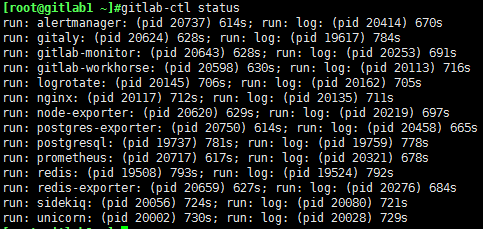
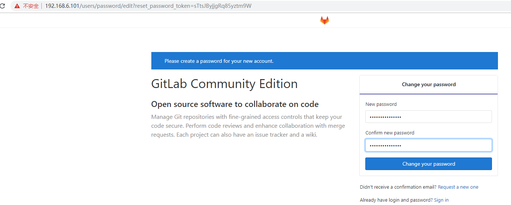
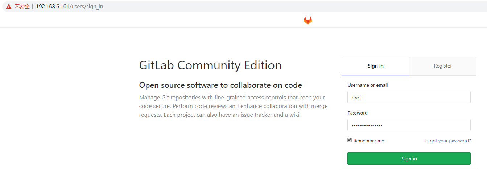
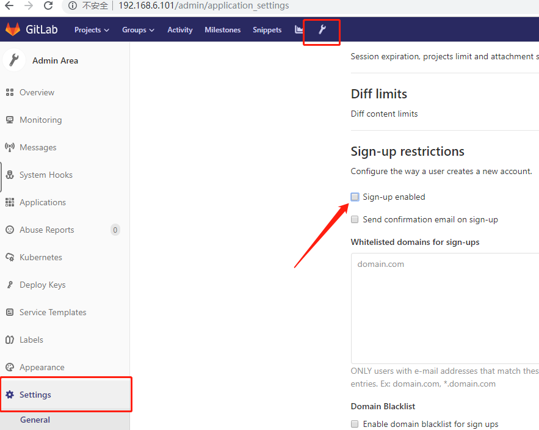

# <h1 id="top">GitLab + Jenkins：</h1>
### <a href="#1">GitLab</a>
### <a href="#2">安装GitLab（Ubuntu 18.04）</a>
### <a href="#3">git常用命令</a>


## <h2 id="1">GitLab：</h2>
&emsp;&emsp;GitLab是一个用于仓库管理系统的开源项目，是一个分布式版本控制系统，它使用Git作为代码管理工具，并在此基础上搭建起来web服务  

&emsp;&emsp;Git在每个用户那里都有一个完整的服务器，并有一个中央服务器，用户可以先将代码提交到本地（无网络也可以），然后在有网络时再提交到中央服务器  
## <h2 id="2">安装GitLab（Ubuntu 18.04）：</h2>
1. 配置仓库：
```shell
vim /etc/apt/sources.list

deb http://mirrors.aliyun.com/ubuntu/ bionic main restricted universe multiverse
deb-src http://mirrors.aliyun.com/ubuntu/ bionic main restricted universe multiverse

deb http://mirrors.aliyun.com/ubuntu/ bionic-security main restricted universe multiverse
deb-src http://mirrors.aliyun.com/ubuntu/ bionic-security main restricted universe multiverse

deb http://mirrors.aliyun.com/ubuntu/ bionic-updates main restricted universe multiverse
deb-src http://mirrors.aliyun.com/ubuntu/ bionic-updates main restricted universe multiverse

deb http://mirrors.aliyun.com/ubuntu/ bionic-proposed main restricted universe multiverse
deb-src http://mirrors.aliyun.com/ubuntu/ bionic-proposed main restricted universe multiverse

deb http://mirrors.aliyun.com/ubuntu/ bionic-backports main restricted universe multiverse
deb-src http://mirrors.aliyun.com/ubuntu/ bionic-backports main restricted universe multiverse
```
2. 安装工具包：
```shell
apt install -y iproute2 ntpdate tcpdump telnet traceroute nfs-kernel-server nfs-common lrzsz tree openssl libssl-dev libpcre3 libpcre3-dev zlib1g-dev gcc openssh-server iotop unzip zip ipmitool
```
3. 安装GitLab：  
[GitLab安装包下载地址](https://packages.gitlab.com/gitlab/gitlab-ce)  
+ deb包安装：
```shell
dpkg -i gitlab-ce_11.11.5-ce.0_amd64.deb 
```  
  
4. 配置GitLab：
```shell
vim /etc/gitlab/gitlab.rb
```
```shell
grep "^[a-Z]" /etc/gitlab/gitlab.rb

external_url 'http://192.168.6.101'
gitlab_rails['gitlab_email_from'] = '2282015515@qq.com'
gitlab_rails['smtp_enable'] = true
gitlab_rails['smtp_address'] = "smtp.qq.com"
gitlab_rails['smtp_port'] = 465
gitlab_rails['smtp_user_name'] = "2282015515@qq.com"
gitlab_rails['smtp_password'] = "此处为smtp授权码"
gitlab_rails['smtp_domain'] = "qq.com"
gitlab_rails['smtp_authentication'] = "login"
gitlab_rails['smtp_enable_starttls_auto'] = true
gitlab_rails['smtp_tls'] = true
user['git_user_email'] = "2282015515@qq.com"
```
5. 初始化服务：
+ 执行配置并启动服务：
```shell
gitlab-ctl reconfigure
```
+ gitlab常用命令：
    + gitlab-psql：数据库命令行

    + gitlab-rake：数据备份恢复等数据操作
    + gitlab-ctl stop|start|restart：停止/启动/重启gitlab
    + gitlab-ctl status：查看组件运行状态
    + gitlab-ctl tail nginx：查看某个组件的日志，如nginx
6. 验证：
+ 使用gitlab-ctl status命令验证gitlab启动成功：
```
gitlab-ctl status
```  

+ 查看端口（gitlab默认监听端口为80，所以在初始化时要求80端口没有被其他程序占用，否则初始化会失败）：
```
lsof -i:80
```
7. 登录web页面：  
    + 首次登录需要设定密码：  
    
    + 登录（默认用户为root）：  
      
8. 关闭账号注册：  
  
## <h2 id="3">git常用命令：</h2>
+ 设置全局用户名：
```
git config --global user.name "NAME"
```
+ 设置全局邮箱：
```
git congfig --global user.email "xxx@xx.com"
```
+ 列出用户的全局设置：
```
git config --global --list
```
+ 添加指定文件、目录或当前目录下所有数据到暂存区：
```
git add FILE
git add /
git add .
```
+ 提交文件到工作区：
```
git commit -m "COMMENT"
```
+ 查看工作区的状态：
```
git status
```
+ 提交代码到服务器：
```
git push
```
+ 获取代码到本地：
```
git pull
```
+ 查看操作日志：
```
git log
```
+ 定义忽略文件：
```
vim .gitignore
```
+ 获取每次提交的ID（可使用--hard根据提交的ID进行指定版本的回退）：
```
git reflog
```
+ git版本回滚（HEAD为当前版本，加上一个"^"为上一个版本，加上两个"^"为上上个版本，指定ID可回退到指定的版本）：
```
git reset --hard HEAD[^][^]

git reset --hard ID
```
+ 查看当前所处的分支：
```
git branch
```
+ 创建并切换到一个新的分支：
```
git checkout -b BRANCH_NAME
```
+ 切换分支：
```
git checkout BRANCH_NAME
```
## <a href="#top">回到顶部</a>