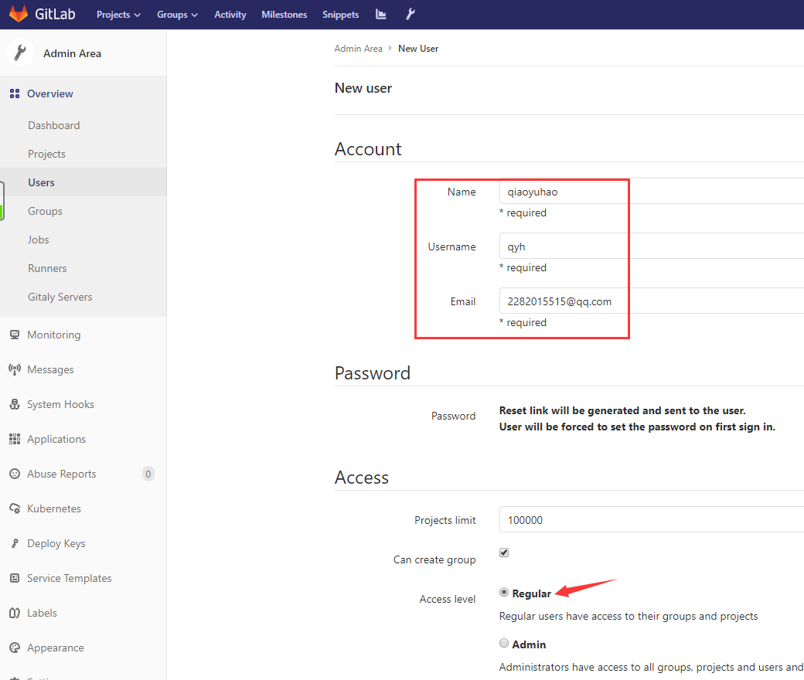
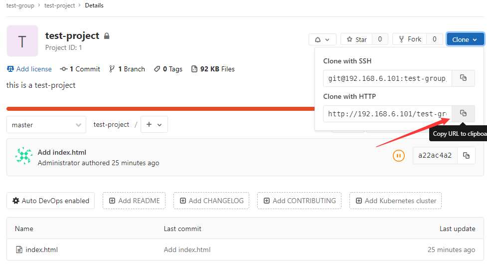

# <h1 id="top">GitLab基础操作：</h1>
### <a href="#1">1. 创建用户</a>
### <a href="#2">2. 创建组</a>
### <a href="#3">3. 新建项目</a>
### <a href="#4">4. 将用户添加到组</a>
### <a href="#5">5. 创建一个测试页面</a>
### <a href="#6">6. 客户端测试clone项目</a>
### <a href="#7">7. 客户端编辑文件并测试提交</a>
### <a href="#8">8. gitlab数据备份及恢复</a>


## <h2 id="1">创建用户：</h2>
+ 创建一个普通用户：  
    + 创建：  
      
    + 邮件提醒：  
      
+  新创建的用户首次登录需要设置密码：  
    + 首次登录：  
      
    + 通过收到的邮件中给出的链接，设置密码：  
      
    + 设置密码后，收到邮件提醒：  
      
    + 之后新用户就可以使用设置好的密码登录了：  
      
## <h2 id="2">创建组：</h2>
+ 创建组（使用管理员）：  
&emsp;&emsp;一个**group**（组）中可以有多个**project**（项目），生产环境中可以将开发人员添加到**group**中并进行设置权限，不同的**group**对应公司不同的开发项目或服务模块，不同的**group**添加不同的开发即可实现对开发设置权限的管理

## <h2 id="3">新建项目：</h2>  
+ 新建项目（使用管理员）：
  
+ 查看新建的项目：  
## <h2 id="4">将用户添加到组：</h2>  
+ 添加用户：  
  
+ 查看当前组中用户及邮件提醒： 
  
## <h2 id="5">创建一个测试页面：</h2> 
+ 在项目页面中点击new file：  
  
+ 创建页面：  
  
+ 查看项目中的文件：  
  
## <h2 id="6">客户端测试clone项目：</h2> 
+ 在web界面复制clone地址：  
  
+ 客户端clone项目：  
  
+ 查看clone下来的项目内容：  
  
## <h2 id="7">客户端编辑文件并测试提交：</h2> 
+ 修改文件内容：  
  
+ 提交：
    + 进入项目目录：
    ```
    [root@jenkins ~]#cd test-project/
    ```
    + 将项目内容添加到暂存区：
    ```
    [root@jenkins test-project]#git add index.html 
    ```
    + 将暂存区中的内容提交到版本库：
    ```
    [root@jenkins test-project]#git commit -m "v1"
    ```
    >执行git commit -m "v1"命令时报以下错误的解决方法：  
    
    ```
    [root@jenkins test-project]#git config --global user.email "2282015515@qq.com"

    [root@jenkins test-project]#git config --global user.name "qyh"
    ```
    + 将本端**分支**与修改推送至远端的**分支**并合并：
    ```
    [root@jenkins test-project]#git push
    ```
+ 在web界面验证是否更新：  

## <h2 id="8">gitlab数据备份及恢复：</h2> 
1. 停止gitlab数据服务：
```
[root@gitlab1 ~]#gitlab-ctl stop unicorn

[root@gitlab1 ~]#gitlab-ctl stop sidekiq
```
2. 手动备份数据（在任意目录下都可以备份当前gitlab数据）：
```
[root@gitlab1 ~]#gitlab-rake gitlab:backup:create
```  
  

3. 备份完成后启动gitlab（由于前面停止了两个服务，所以这一步其实只启动了那两个被停止的服务；备份后的文件为一个tar包，名字前缀为unix时间戳，存放于/var/opt/gitlab/backups/下）：
```
[root@gitlab1 ~]#gitlab-ctl start
```  
4. 在web页面删除index.html：  
  
5. 执行恢复之前先停止数据服务：
```
[root@gitlab1 ~]#gitlab-ctl stop unicorn

[root@gitlab1 ~]#gitlab-ctl stop sidekiq
```
6. 执行恢复（“BACKUP=”后跟的不是tar包的全名，执行命令后要输入两次yes）：
```
[root@gitlab1 ~]#gitlab-rake gitlab:backup:restore BACKUP=1563508344_2019_07_19_11.11.5
```
7. 启动服务，web界面查看时数据已恢复：
```
[root@gitlab1 ~]#gitlab-ctl start
```


## <a href="#top">回到顶部</a>