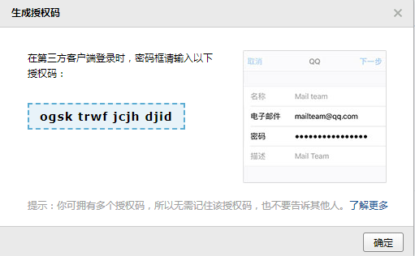

# <h1 id="top">Jenkins（基于Ubuntu 18.04）：</h1>
### <a href="#1">1. 配置Java环境</a>
### <a href="#2">2. 安装Jenkins</a>
### <a href="#3">3. 配置Jenkins权限管理</a>
### <a href="#4">4. 配置Jenkins邮箱</a>
### <a href="#5">5. 新建任务</a>
### <a href="#6">6. 基于ssh key拉取代码</a>

## <h2 id="1">配置Java环境：</h2>
1. 下载并解压jdk：
```
tar xvf jdk-8u192-linux-x64.tar.gz
```
2. 创建软链接：
```
ln -sv /usr/local/src/jdk1.8.0_192/ /usr/local/jdk
ln -sv /usr/local/jdk/bin/java /usr/bin/
```
3. 添加环境变量：
```shell
vim /etc/profile

#添加如下三行
export JAVA_HOME=/usr/local/jdk
export PATH=$JAVA_HOME/bin:$JAVA_HOME/jre/bin:$PATH
export CLASSPATH=.$CLASSPATH:$JAVA_HOME/lib:$JAVA_HOME/jre/lib:$JAVA_HOME/lib/tools.jar
```
4. 使环境变量生效：
```
. /etc/profile
```
5. 查看java版本以验证环境变量是否成功添加：
```
java -version
```
## <h2 id="2">安装Jenkins：</h2>
1. 解决依赖关系，先安装daemon：
```
apt install -y daemon
```

2. 安装Jenkins：
```
dpkg -i jenkins_2.164.3_all.deb
```
3. 修改配置文件，做如下修改：
```
vim /etc/default/jenkins

JAVA_ARGS="-Djava.awt.headless=true -server -Xms1g -Xmx1g -Xss512k -Xmn1g \
-XX:CMSInitiatingOccupancyFraction=65 \
-XX:+UseFastAccessorMethods \
-XX:+AggressiveOpts -XX:+UseBiasedLocking \
-XX:+DisableExplicitGC -XX:MaxTenuringThreshold=10 \
-XX:NewSize=2048M -XX:MaxNewSize=2048M -XX:NewRatio=2 \
-XX:PermSize=128m -XX:MaxPermSize=512m -XX:CMSFullGCsBeforeCompaction=5 \
-XX:+ExplicitGCInvokesConcurrent -XX:+UseConcMarkSweepGC -XX:+UseParNewGC \
-XX:+CMSParallelRemarkEnabled -Djava.awt.headless=true \
-Dcom.sun.management.jmxremote \
-Dcom.sun.management.jmxremote.port=12345 \
-Dcom.sun.management.jmxremote.authenticate=false \
-Dcom.sun.management.jmxremote.ssl=false \
-Djava.rmi.server.hostname="192.168.6.111""

JENKINS_USER=root
JENKINS_GROUP=root
```
4. 启动Jenkins：
```
systemctl start jenkins
```
5. 访问web界面并解锁：  
  
6. 安装推荐插件：  
  
7. 创建管理员admin
8. 配置Jenkins URL为默认：http://192.168.6.111:8080/
9. 配置完成，登录Jenkins：  
  
  
10. 安装插件：  
  
  
## <h2 id="3">配置Jenkins权限管理：</h2>
1. 安装插件：  
  
2. 创建新用户：  
  
3. 更改认证方式：  
  
4. 创建角色：  
  
5. 为角色分配权限：  
  
6. 将用户关联至角色：  
  
7. 普通用户登录测试（没有管理选项）：  
  
## <h2 id="4">配置Jenkins邮箱：</h2>
1. 生成qq邮箱登录授权码：
  
2. 配置管理员邮箱：  
  
  
3. 设置邮件通知：  
  
4. 发送测试邮件并验收：  
  
## <h2 id="5">新建任务：</h2>  
+ 新建任务：  
  
+ 构建环境中启用此项：  
  


## <h2 id="6">基于ssh key拉取代码：</h2>
+ gitlab服务器：
1. 添加ssh key：  
  
2. 在Jenkins服务器上测试ssh拉取代码：  
 
+ Jenkins服务器：
1. 在Jenkins服务器上生成ssh密钥对：
```
ssh-keygen
```
2. 添加凭据：  
  
  
3. 查看生成的凭据：  
  
4. 在创建好的项目中设置git项目的地址和用户，然后保存：  
  
5. 验证构建结果：  
  
  
## <a href="#top">回到顶部</a>